<!-- -->
<!--(picture from CoPilot)-->

# Data Science Professional Practice
September 2025 term - Year 1 - Term 3

## Public Project - Active lives
[View this project on GitHub](https://github.com/BP0315003/dspp1)  

### Active lives and falls in older adults
An anlysis of area level factors influencing activity levels in older adults with a view to implementing targeted interventions to prevent falls.

#### Project results overview:
Results show older adults’ lower activity is spatially clustered in deprived, urban LSOAs and in areas with higher proportions of carers and single-occupant households.
Rural areas have different challenges with limited access to public green space, abundant green space being mostly private.  Geographically and culturally targeted interventions are needed, support for carers and access to rural facilities.  However, spatial autocorrelation exists and geographicall weighted regression needs to be undertaken to confirm results.

#### Data sources:
  - Sport England - Active Lives, Adults 22/23
  - Census 2021 - Custom datasets
  - ONS - datasets and shape files

## Executive Summary 
Older people are the most sedentary segment of the population, just over half meet physical activity recommendations (Gawler et al., 2016).  Studies show inactive people fall more than moderately or very active people; rates increase for individuals aged 75+.  Injuries sustained “reduce mobility and independence and increase the risk of premature death” (Skelton and Todd, 2004).  Age UK (Fall prevention for the elderly, 2024) advise being active can maintain strength, balance and coordination, preventing falls.

Studies have examined intrinsic risk factors like medications and medical conditions.  This analysis examines factors influencing activity levels in older adults at a Lower Super Output Area (LSOA), focusing on demographics, deprivation, ethnicity, household composition, and green space access.  

Using linear regression on public LSOA data, the goal is to identify areas where targeted interventions can increase activity, improve health outcomes, and ensure equitable access for underserved populations.

### Findings:
Higher proportions of older adults slightly increase predicted activity, but this effect reduces with increased green space distance. 

Deprivation lowers activity, especially in rural areas, indicating need for targeted interventions.  Rural areas with higher non-white populations indicate lower activity; urban areas are less affected, possibly due to better access.

Higher proportions of single occupant households generally lower predicted activity.  Urban areas indicate lower activity, whereas some rural areas have higher levels, likely due to larger gardens or more distant facilities.

Longer distances to green spaces reduce activity; closer green spaces are important for older adults in urban areas.  Carers have the strongest negative impact on activity levels, reflecting constraints and health challenges.

The model performs and generalises well, with an adjusted R² of 42% - acceptable for social and demographic models.  Root mean squared error (RMSE) of 0.048 (train and test) indicates predictions are within 5% and mean absolute error (MAE) at 3.8 percentage points suggests no large outliers.  ‘Moran’s I’ confirms spatial autocorrelation warranting further development to include geographically weighted regression (GWR).

### Conclusion
Despite spatial autocorrelation limits, the model supports established ideas. It can inform tailored interventions addressing urban and rural uniqueness, influencing activity and fall risk in older adults. LSOA data reflects average characteristics, it is not appropriate to infer all individuals are the same.

## Data Infrastructure and Tools 
Public tools for standalone, reproducible pipelines were chosen.

R is preferred, using base regression functions, and libraries like ‘readcsv’ for data ingestion, ‘dplyr’ for data cleaning/manipulation, ‘ggplot2’ for exploratory data analysis (EDA) visualisation, and ‘Corrplot’ for correlations. These are easily installable and well-supported.  

Python offers equivalent libraries (pandas, numpy, seaborn, matplotlib, scikit-learn) for the same tasks. Both are free; Python performs better with ‘big data’ (BasuMallick, 2022), but R suffices for this smaller dataset.  Commercial visual pipeline and modelling tools like Alteryx, add unnecessary cost.

Power BI (PBI) displays LSOA activity data against England benchmarks.  Multiple years’ data were manually combined into a single excel file.  Copilot's accuracy in this task to save time could be explored to process futures published files.  

As Bristol, North Somerset and South Gloucestershire (BNSSG) ICB (Integrated Care Board) will use this data, it was loaded into SQL server for PBI scheduling, although direct import from Excel is possible.  Power query ‘unpivots’ wide datasets into a long format as shown in figure P1, simplifying visualisation with minimal slicers and measures.  

PBI is the organisation’s in-house dashboard tool; however, Quarto provides interactive visuals that are easier to distribute and function as a standalone solution.

## Data Engineering 
Public data was obtained from three sources as csv/excel files: 
•	Sport England - Active lives small area estimates, 
•	Ordinance Survey - LSOA 2011/2012 lookups and Shape files
•	Office of National Statistics (ONS) census and greenspace.  

Datasets are aggregated to LSOA, with no personal identifiers. Organisations are highly professional and reliable, adhering to quality frameworks and setting national standards.
Census data uses disclosure control, rounding and area switching, protecting small numbers.  LSOA volumes minimise analysis impact.

Active lives LSOA estimates are ‘modelled’, introducing some uncertainty.

2022/23 provides the most up-to-date activity insights, noting COVID-related shifts - such as increased activity during lockdowns and potential impacts on self-reported health (ONS, 2021). 

Figure P2 illustrates the ‘extract transform and load’ (ETL) process preparing data for modelling.

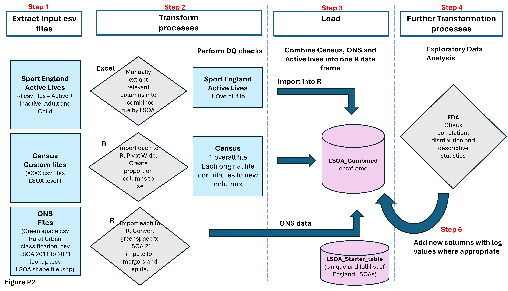

#### Step 1
Individual exposure variables were extracted from ONS/Census ensuring comprehensive LSOA coverage, minimising statistical disclosure.  Files were imported into R.

#### Step 2
To minimise risks from poor or inaccurate model outputs, data quality checks confirmed all files contained 35,672 unique LSOAs (completeness, validity). Ensured no missing or duplicate LSOAs (uniqueness), matched across datasets (consistency), and verified consistent data types. Data were drawn from aligned periods: active lives 2022/23, Census 2021, greenspace 2020 (timeliness) (Meet the data quality dimensions, 2021).  
A single 'null' row was removed from the activity file:  

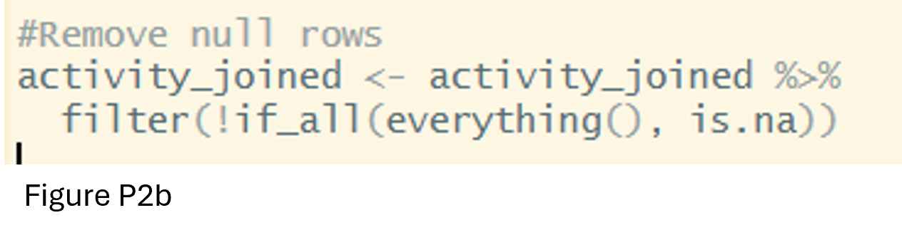

All files use 2021 LSOA codes except for ‘access to green spaces’ which utilises 2011 codes.  A lookup converts to 2021 codes, but some 2011 LSOAs ‘merged’ or ‘split’.

‘Splits’ - new LSOAs inherit old LSOA attributes; ‘merges’ - population-weighted estimates are used, per public health guidance. Imputation ensures complete representation, minimising bias and underrepresentation. (DHSC, 2019)

Files are converted from long to wide format, with one row per LSOA, enabling feature engineering such as proportions of populations aged 75+ and single occupant households.

#### Step 3
Merges all files onto a full LSOA base via left-joins. A subsequent left-join to activity data excluded Welsh LSOAs.

#### Step 4
EDA identified several skewed variables, log transformations normalised distributions. Descriptive statistics, Figure P3, and distribution plots (appendix 1) guided decisions.

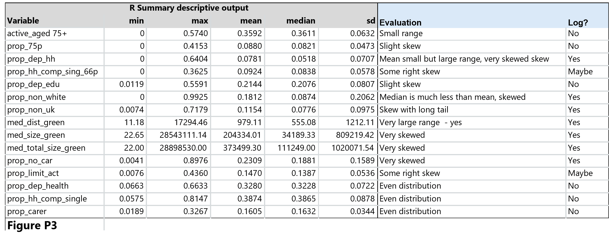

Figure P4 illustrates variables before and after log transformations:

#### Step 5
Amendments to feature-engineered columns were added in step 3.

### Data Analysis 
Ordinary Linear Regression (OLR) models how activity levels in older adults vary with LSOA variables, informing targeted interventions and resource distribution. 

(Feng, Miao and Turner, 2025) spatial autocorrelation at LSOA level as a limitation, as adjacent areas often share characteristics, yet OLR assumes independent observations potentially resulting in misleading results.  
‘Moran’s I’ (Bobbitt, 2021) will be performed assessing whether LSOAs are more similar than expected by chance.  If significant spatial autocorrelation is detected, Geographically Weighted Regression (GWR) will be necessary.

Compernolle et al., 2022, identified that variables such as age structure, health, functional ability, deprivation, income, education, marital status, and access to facilities most broadly influence activity levels.  

A correlation analysis (Figure P5) was conducted on census variables; those with minimal (<=0.75) correlation and wide relevance were included in the model.  

Rurality, initially tested as a binary variable, showed strong effects on certain variables - especially single households and non-UK language speakers - as illustrated in figure P6.

Active_aged_75+ is a continuous variable measuring ≥60 minutes of activity in adults aged 75+. The focus is on factors enhancing activity, not inactivity percentages. Distribution is normal with no significant outliers:

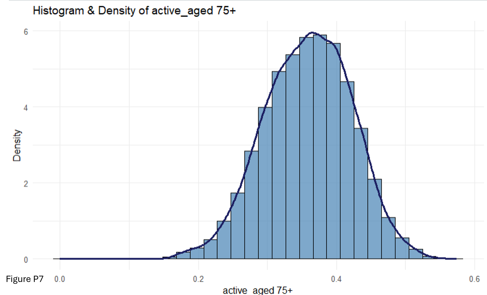

Data was split 70:30 for training and testing. OLR was performed on the training data and applied to the test data with the following results:

RMSE and MAE are consistent between train and test.  Activity levels range between 14% to 57%, and no significant outliers, making RMSE (0.048 or 4.8%) reliable. The small difference (3.8 percentage points) between RMSE and MAE indicates no overfitting.  Mean Absolute Percentage Error (MAPE) risks instability due to low activity values and zeros (Frost, 2025).

R² and adjusted R² are similar, explaining 42% of variance, the model generalises well performing consistently to unseen data (Figure P8).  0.42 is realistic for social models influenced by human, area, and policy factors (Frost, 2017). 

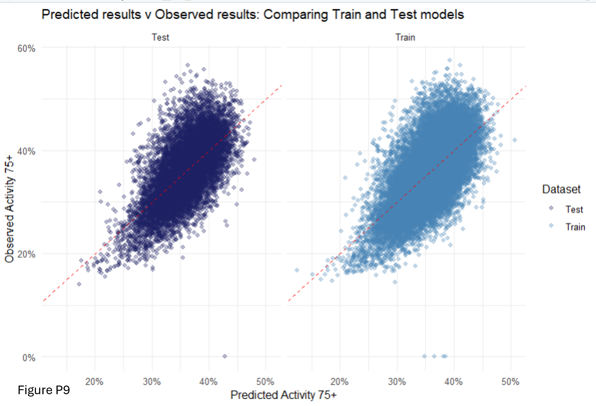

#### Interpretation
Positive coefficients indicate higher predicted activity; negative coefficients indicate reductions.  All variables are statistically significant (p < 0.05), though some coefficients are small due to the large sample (23,615 LSOAs). Effect sizes are more meaningful (Frost, 2021), variables are visualised on a map in appendix 3, highlighting key LSOAs.

Results show older adults’ lower activity is spatially clustered in deprived, urban LSOAs and in areas with higher proportions of carers and single-occupant households.

Rural areas have different challenges with limited access to public green space, abundant green space being mostly private.  Geographically and culturally targeted interventions are needed, support for carers and access to rural facilities. 

Testing combined interactions may reveal further intervention nuances. 

## Data Visualisation 
A subset of BNSSG activity data is presented in Power BI, with bar charts comparing England, South West, and Local Authority levels. All ages and indicators across published years are available (figure P9). Interactive filters allow users to select data and areas of interest (appendix 4).  

LSOA choropleth maps (Figure P10) show percentage activity, highlighting high and low areas; tooltips display exact values. Colours follow mandated organisational guidelines; percentage figures are shown on bars.  

Export and screenshot options support business use.

## Recommendations
Undertake geographically weighted regression mitigating spatial autocorrelation.

Test combined interactions, especially involving deprivation and ethnicity, as they may affect intervention nuances

Engage with health and voluntary organisations, local authorities and those with lived experience to understand socio demographical influences, to refine the model and targeted interventions.

 
## References
BasuMallick, C. (2022) ‘R vs. Python’, Spiceworks Inc, 6 December. Available at: https://www.spiceworks.com/tech/devops/articles/r-vs-python/ (Accessed: 13 December 2025).

Bobbitt, Z. (2021) ‘What is Moran’s I? (Definition & Example)’, Statology, 28 January. Available at: https://www.statology.org/morans-i/ (Accessed: 27 November 2025).

Compernolle, S. et al. (2022) ‘The role of socio-demographic factors and physical functioning in the intra- and interpersonal variability of older adults’ sedentary time: an observational two-country study’, BMC Geriatrics, 22, p. 495. Available at: https://doi.org/10.1186/s12877-022-03186-1.

DHSC (2019) Public Health methods. Available at: https://fingertips.phe.org.uk/profile/guidance/supporting-information/ph-methods (Accessed: 13 December 2025).

Fall prevention for the elderly (2024) Age UK. Available at: https://www.ageuk.org.uk/information-advice/health-wellbeing/exercise/falls-prevention/ (Accessed: 5 December 2025).

Feng, Y., Miao, Y. and Turner, E. (2025) ‘Examining spatial variations in the relationship between domestic energy consumption and its driving factors using multiscale geographically weighted regression: a case study in 
Nottingham, England’, Energy, Sustainability and Society, 15(1), p. 24. Available at: https://doi.org/10.1186/s13705-025-00523-1.

Frost, J. (2017) ‘How to Interpret Regression Models that have Significant Variables but a Low R-squared’, Statistics By Jim, 13 May. Available at: http://statisticsbyjim.com/regression/low-r-squared-regression/ (Accessed: 4 December 2025).

Frost, J. (2021) ‘Effect Sizes in Statistics’, Statistics By Jim, 23 March. Available at: https://statisticsbyjim.com/basics/effect-sizes-statistics/ (Accessed: 6 December 2025).

Frost, J. (2025) ‘Mean Absolute Percentage Error’, Statistics By Jim. Available at: https://statisticsbyjim.com/glossary/mean-absolute-percentage-error/ (Accessed: 14 December 2025).

Gawler, S. et al. (2016) ‘Reducing falls among older people in general practice: The ProAct65+ exercise intervention trial’, Archives of Gerontology and Geriatrics, 67, pp. 46–54. Available at: https://doi.org/10.1016/j.archger.2016.06.019.

Meet the data quality dimensions (2021) GOV.UK. Available at: https://www.gov.uk/government/news/meet-the-data-quality-dimensions (Accessed: 2 May 2025).

ONS (2021) How has lockdown changed our relationship with nature? - Office for National Statistics. Available at: https://www.ons.gov.uk/economy/environmentalaccounts/articles/howhaslockdownchangedourrelationshipwithnature/latest (Accessed: 13 December 2025).

Skelton, D. and Todd, C. (2004) ‘What are the main risk factors for falls amongst older people and what are the most effective interventions to prevent these falls?’, What are the main risk factors for falls  amongst older people and what are the  most effective interventions to prevent  these falls? [Preprint]. Available at: https://iris.who.int/server/api/core/bitstreams/d0f7d347-3799-4269-9106-e73e94f561ae/content (Accessed: 6 November 2025).

## Appendix 1
#### Public project – Distribution plots to inform variable selection and log requirements

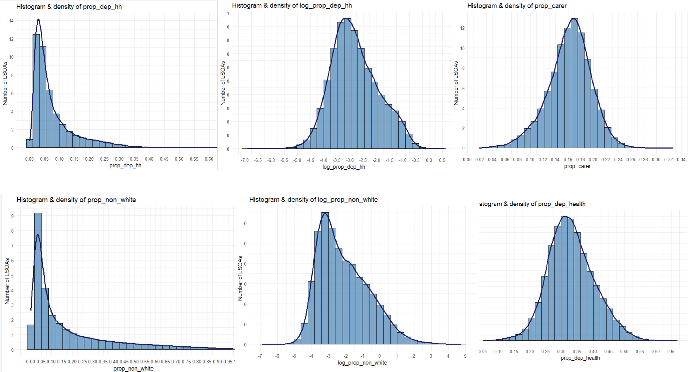

## Appendix 2
#### Public project – R model outputs
Initial variable correlation prior to removing variables with multicollinearity:

Linear Regression summary output:

## Appendix 3
#### Public project – Effect size maps
Effects are identified for LSOAs in training data and derived for LSOAs not included.

#### Proportion of Older adults:
Darker areas represent urban, inner-city LSOAs with younger populations and fewer older adults. Lighter yellow/orange LSOAs (around 0.6) have higher proportions of older adults and predicted activity levels, supporting the model linking older age with increased activity.   Focus interventions on darker LSOAs with fewer older adults and lower activity, or mid-range areas when including deprivation or carer presence.

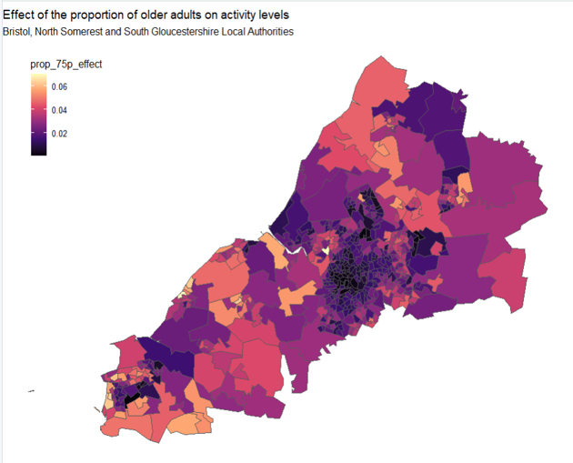
Figure A3a  

#### Proportion of households in the deprived dimension:
Darkest LSOAs, in the most deprived 20% of England, have marginally lower activity levels among older adults. Targeted community support could increase their activity.

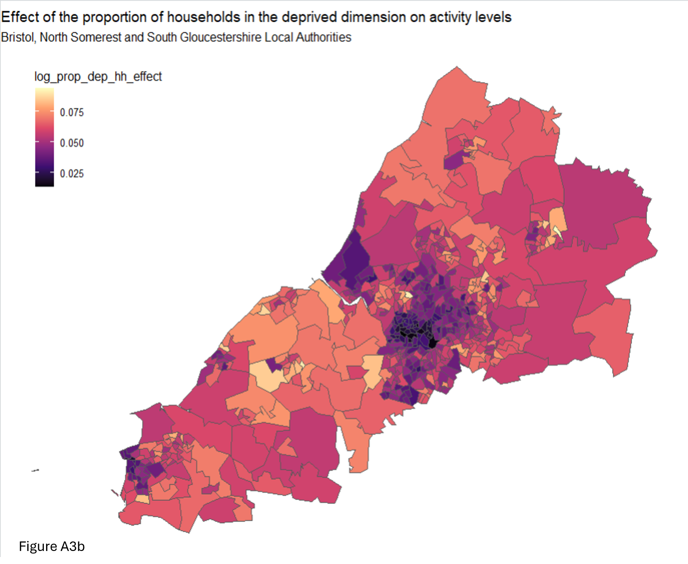

#### Proportion of non-white ethnicity:
Darker LSOAs in urban areas have higher non-white populations and negative coefficients, indicating reduced activity among older adults. Lighter LSOAs have fewer non-white residents and minimal impact on activity.

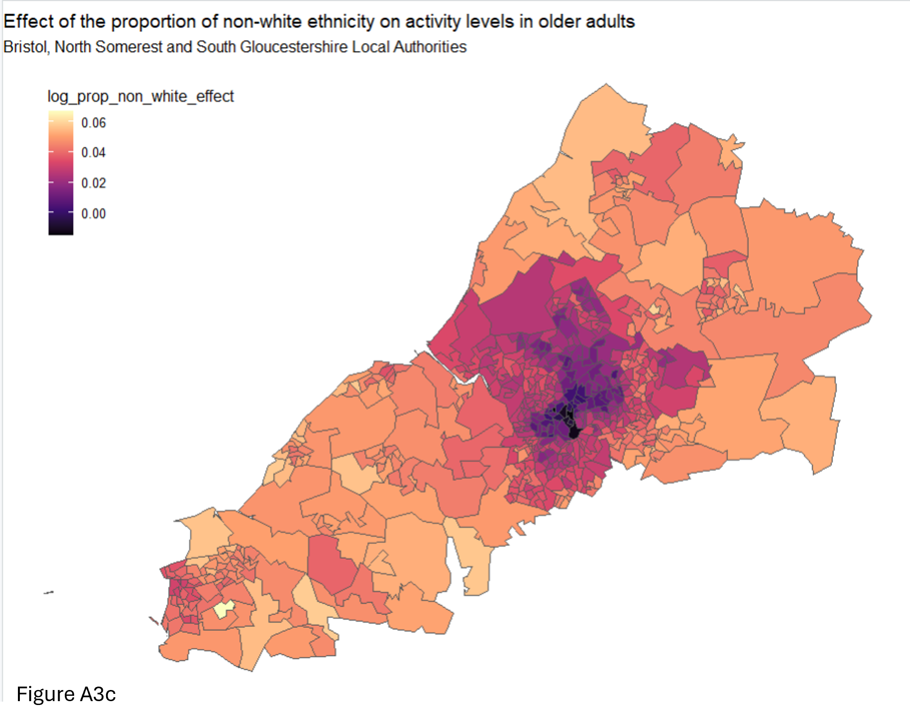

#### Proportion of households with carers:
Darker LSOAs outside inner cities have higher proportions of households with carers and greater negative impacts on older adults’ activity levels (coefficients > -0.15). These areas are typically rural and known for older populations. Targeted interventions in these areas could support carers to be more active, especially in rural LSOAs with limited access to facilities.

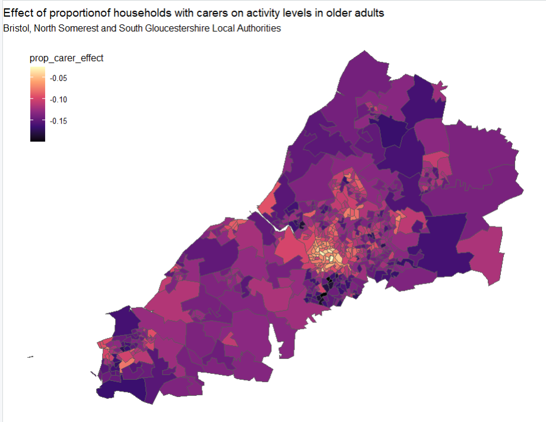
Figure A3d  

Darker LSOAs (coeffients -0.1 to 0.125) are located in areas know to have higher proportions of older adults indicating a negative effect (lower activity levels).  Some of these areas coincide with higher proportions of households with carers, compounding the effects on activity levels.  Support needs are likely to be different to suit different needs.

#### Distance to green space:
Darker LSOA coefficients (closer to 0) are found in urban areas, indicating populations are nearer to green spaces. Lighter areas, more rural and less urban, suggest greater distances. This appears counterintuitive since rural areas are generally greener. The indicator measures proximity to public parks and gardens, which may be less accessible in rural regions. While green spaces may be closer in cities, this does not reflect their total size.

#### Total green space size:
Darker LSOAs are rural or less populated, with limited public green space and longer distances to access it. Rural areas have large green areas, but these are mostly non-public; footpaths are not included in green space measures. Larger green spaces are typically on city outskirts and suburbs. Overall, the impact of space size on activity levels is minimal.

#### Map of Active older adult activity percentages:
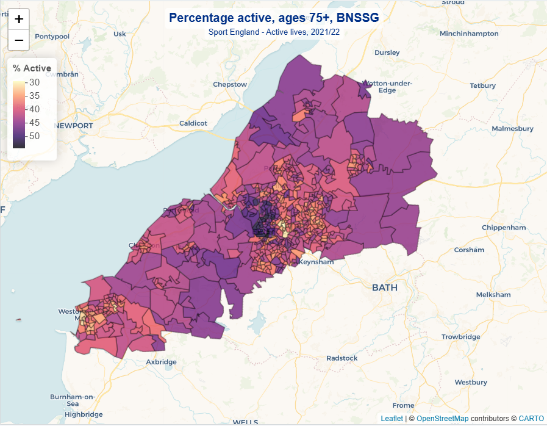
Figure A3g   
(produced in leaflet package rather than ggplot2).

## Appendix 4
#### Public project – Power BI Filter options for Active lives measures

## Appendix 5
#### Public project – Work project Exploratory data analysis
#### Population by Acorn groups:

Figure A5a  

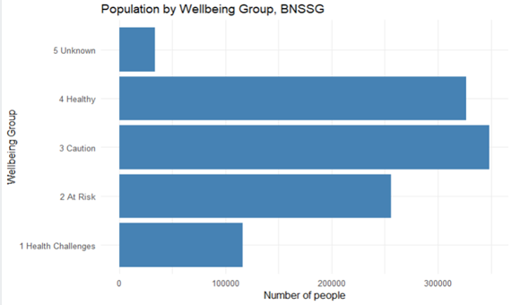
Figure A5b  

#### Histograms of people by LSOA:
3 Large LSOA values relate to large university accommodation sites.  Population is transient.

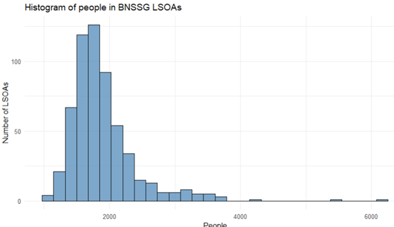
Figure A5c  

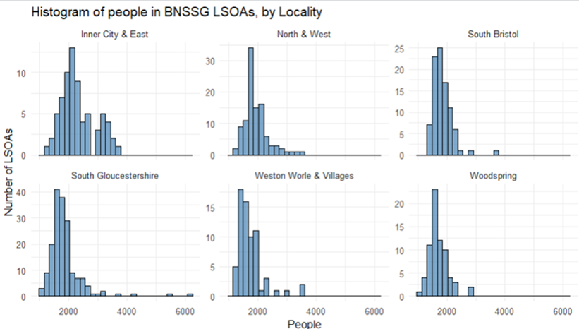
Figure A5d  

#### Distribution of Age:
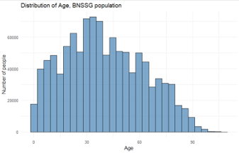
Figure A5e  

#### Distribution of Age by Locality:

Figure A5f  

#### Distribution of IMD:
PCA scaling prevents IMD from dominating.

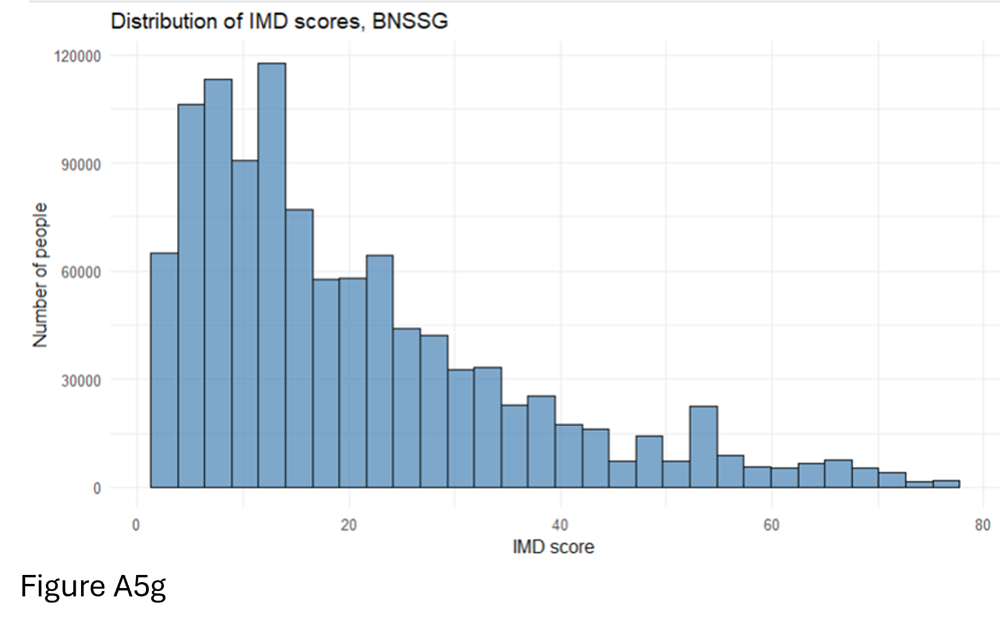
Figure A5g  

## Appendix 6
#### Public project – R syntax for regression and Moran’s I

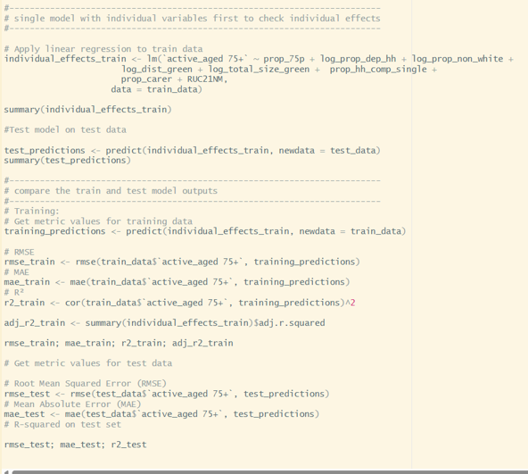
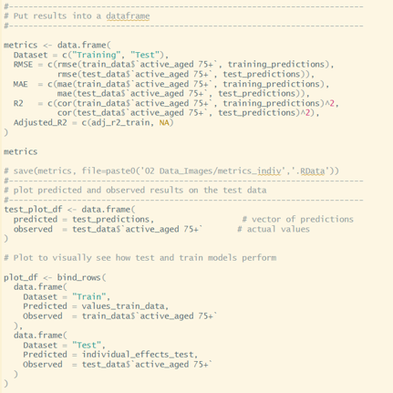
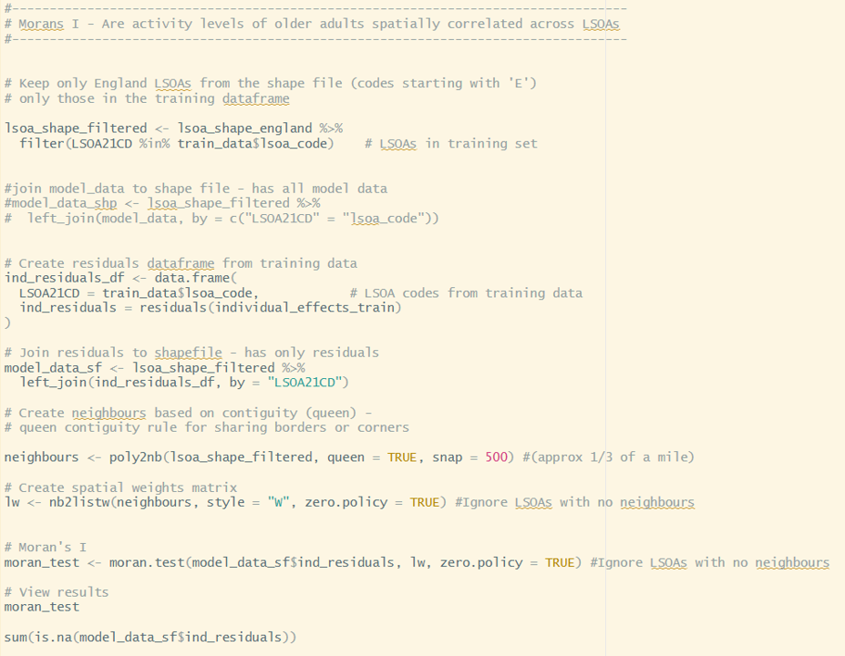

## Appendix 7
#### Data sources and links
 Census adults and children in household https://www.ons.gov.uk/datasets/create/filter-outputs/b5fa5921-c49f-412b-bb75-6ebaac8bf8a7#get-data
 
 Dependant children in household https://www.ons.gov.uk/datasets/create/filter-outputs/a645b541-f4bb-43ff-ba4c-b3cbf9acce75#get-data
 
 Deprived in household dimension https://www.ons.gov.uk/datasets/create/filter-outputs/41811325-3df1-4905-be14-cab83d9c1063#get-data
 
 Day to day activities limited a lot https://www.ons.gov.uk/datasets/create/filter-outputs/aac81789-b89c-4631-babd-ae3e4215f7fa#get-data
 
 Economic activity https://www.ons.gov.uk/datasets/create/filter-outputs/30c9791a-20b4-441b-a01a-1916677624d4#get-data
 
 Age https://www.ons.gov.uk/datasets/create/filter-outputs/2de81125-a6b6-46bb-8432-ce1cb2d527c4#get-data
 
 General health https://www.ons.gov.uk/datasets/create/filter-outputs/4471e9bb-a9f2-4dac-b84b-45bbedb62395#get-data

 Hours worked https://www.ons.gov.uk/datasets/create/filter-outputs/876cb362-4005-4c75-bd12-9a3e5971127e#get-data

 Main language https://www.ons.gov.uk/datasets/create/filter-outputs/6cc18cae-6147-4d23-9e78-f12c4c170d34#get-data

 Household composition https://www.ons.gov.uk/datasets/create/filter-outputs/50c4be76-0011-43f6-b868-f7e9e4eda219#get-data
 
 Unpaid carer https://www.ons.gov.uk/datasets/create/filter-outputs/a7211e9b-6233-40d5-9bf5-61d33af04a81#get-data
 
 Health https://www.ons.gov.uk/datasets/create/filter-outputs/9282411a-79ea-4874-84cd-20448a9cf919#get-data

 Deprived in health dimension https://www.ons.gov.uk/datasets/create/filter-outputs/1feb654b-5fc4-48d0-a109-53e2e49a4e0f#get-data

 Ethnic group https://www.ons.gov.uk/datasets/create/filter-outputs/c6ac687f-b2ce-435e-beb2-cbe1758ec96d#get-data

 Active Lives Active Lives Small Area Estimates Tool | Sport England

 Access to green space Access to public green space in Great Britain - Office for National Statistics
 
 LSOA lookup LSOA (2011) to LSOA (2021) to Local Authority District (2022) Exact Fit Lookup for EW (V3) - data.gov.uk
 

